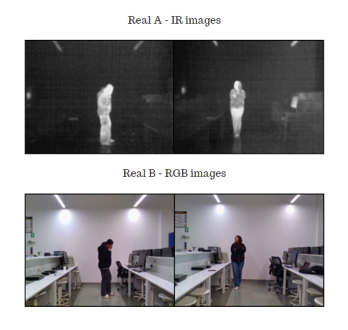
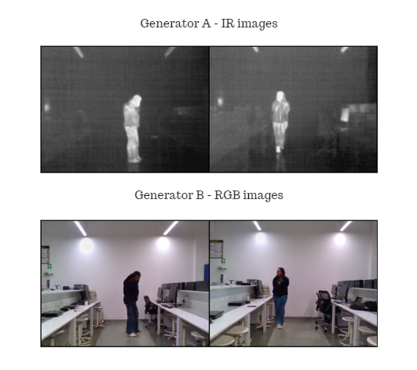

## IR to RGB Image Translation (Pose Estimation and Classification)

• This repository proposes utilizing an unpaired image-toimage translation technique, specifically CycleGAN, to colorize thermal images.

• Model checkpoint folder contains 4 model checkpoints (2 for Discriminators and 2 for Generators)

  
 

  
 
